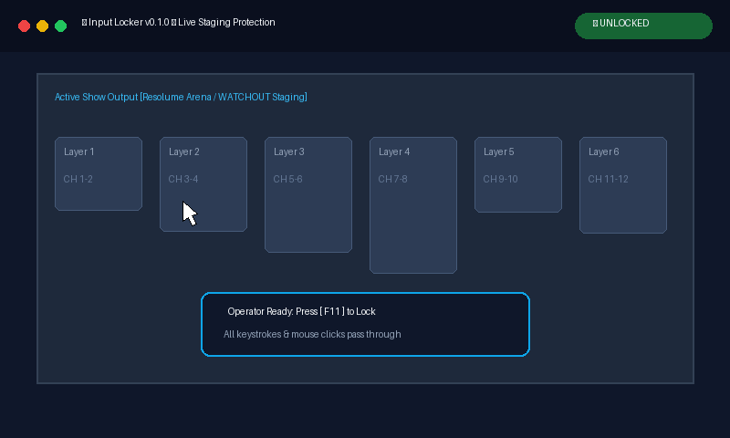
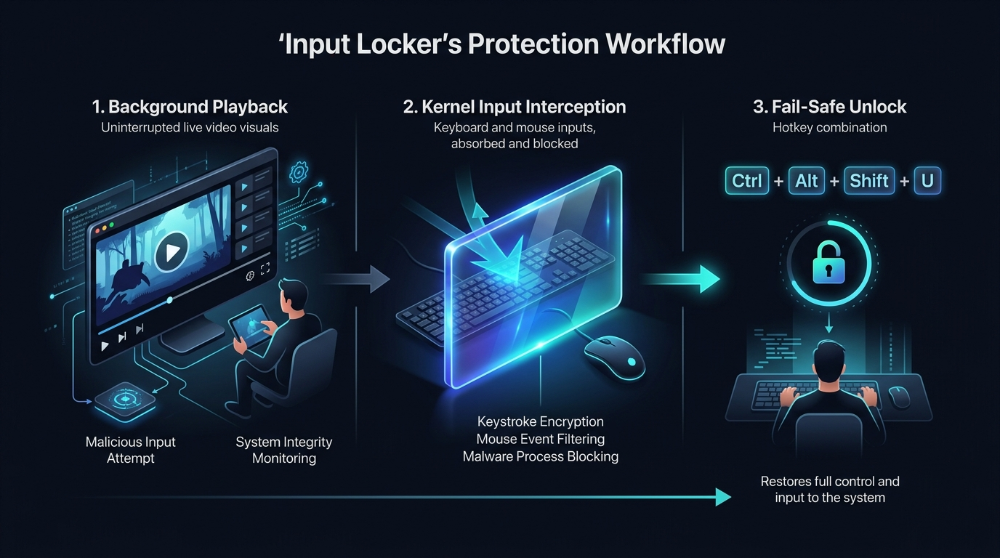

# Windows AV Staging Input Locker

[](LICENSE)
[](https://microsoft.com/windows)
[](https://github.com/SHARUNJOSEPH/input-locker/actions/workflows/ci.yml)
[](.github/workflows/security.yml)
[](https://partner.microsoft.com/)
[](https://github.com/users/SHARUNJOSEPH/projects/3)
[](https://github.com/SHARUNJOSEPH/input-locker/releases)

<p align="center">
  
</p>

<p align="center">
  <a href="https://github.com/SHARUNJOSEPH/input-locker/releases/latest">
    
  </a>
  <a href="https://github.com/SHARUNJOSEPH/input-locker/releases/latest">
    
  </a>
  <a href="https://github.com/users/SHARUNJOSEPH/projects/3">
    
  </a>
  <a href="https://github.com/SHARUNJOSEPH/input-locker/releases">
    
  </a>
</p>

---

## 🎬 Live Demo & Staging Workflow

<p align="center">
  
</p>

*Watch Input Locker in action: seamlessly switching from normal desktop interaction to full OS-level input swallowing in under 3 milliseconds, with a non-activating semi-transparent HUD overlay protecting stage playback.*

A high-performance, zero-latency background utility engineered for Windows live audiovisual (AV) staging and event production environments (e.g., Resolume Arena, Dataton WATCHOUT, QLab, grandMA, DAWs, PowerPoint presentations).

`input-locker` intercepts and swallows all global keyboard and mouse inputs at the Windows OS kernel/hook level to create a tamper-resistant "locked" state, while keeping active background rendering engines fully visible and operating through a non-activating, semi-transparent glass overlay.

---

## 📥 Installation & Download Packages

Choose your preferred download package. **No Python or external runtimes are required!**

## 📥 Direct Downloads

| Package | Format | Architecture | Download Link |
| :--- | :---: | :---: | :--- |
| **Input Locker Windows Installer** | Setup Wizard (.exe) | Windows 10 / 11 (64-bit) | [💿 **Download `InputLocker-Setup-v0.2.2.exe`**](https://github.com/SHARUNJOSEPH/input-locker/releases/latest/download/InputLocker-Setup-v0.2.2.exe) |
| **Input Locker Standalone** | Portable `.exe` | Windows 10 / 11 (64-bit) | [⬇️ **Download `InputLocker.exe`**](https://github.com/SHARUNJOSEPH/input-locker/releases/latest/download/InputLocker.exe) |
| **Input Locker Portable Bundle** | `.zip` | Windows 10 / 11 (64-bit) | [📦 **Download `InputLocker-v0.2.2-Windows-x64.zip`**](https://github.com/SHARUNJOSEPH/input-locker/releases/latest/download/InputLocker-v0.2.2-Windows-x64.zip) |
| **All Versions & Release Notes** | Web | Any Browser | [🏷️ **Browse All Releases**](https://github.com/SHARUNJOSEPH/input-locker/releases) |

### ⚡ Command-Line Install (`winget`)

```powershell
winget install SharunJoseph.InputLocker
```
*(Official package manifests in [`packaging/winget`](packaging/winget/) — see [Winget Submission Guide](docs/WINGET_SUBMISSION.md))*

> [!TIP]
> **Zero Installation Setup**: Simply download **`InputLocker.exe`**, place it on your Desktop or in your staging folder, and double-click to launch!

---

## 🚀 How to Use Input Locker

1. **Launch**: Double-click **`InputLocker.exe`**.
   - On first launch, a helpful **Interactive Tutorial Guide** and the **Apple-style Settings** panel will appear.
2. **Lock Screen**:
   - Press <kbd>F11</kbd> at any time, or click **"🔒 Lock Screen Now"** in settings.
   - All mouse and keyboard inputs will be completely blocked while keeping your background video/audio engines running smoothly.
3. **Unlock Screen**:
   - Press <kbd>Ctrl</kbd> + <kbd>Alt</kbd> + <kbd>Shift</kbd> + <kbd>U</kbd> together.
   - If a password is set, the secure unlock prompt will appear; otherwise, it unlocks instantly.
4. **Single-Instance Protection**:
   - Double-clicking the app icon while running will simply bring the existing settings window to the front — preventing duplicate processes or multiple windows.

## Architecture & Principles

<p align="center">
  
</p>

1. **Zero Focus Disruption**:
   - The semi-transparent overlay window is constructed with Win32 extended styles `WS_EX_NOACTIVATE | WS_EX_TRANSPARENT | WS_EX_LAYERED | WS_EX_TOOLWINDOW` and displayed via `SetWindowPos` with `SWP_NOACTIVATE | SWP_SHOWWINDOW`.
   - Guaranteed 0 `WM_ACTIVATE`, `WM_KILLFOCUS`, or `WM_NCACTIVATE` messages delivered to background rendering applications.
2. **Deterministic Input Swallowing**:
   - Low-level OS hooks (`WH_KEYBOARD_LL`, `WH_MOUSE_LL`) intercept input before it reaches Windows application message queues.
   - Returning `1` from the hook callback discards events instantly.
3. **In-Filter Hotkey Processing**:
   - Hotkeys are processed directly inside the hook filter procedure, evaluating `WM_KEYDOWN` and `WM_SYSKEYDOWN` (Alt-key sequences) without queue latency.
4. **Sub-Millisecond State Transitions**:
   - Thread-safe 4-state Finite State Machine (`UNLOCKED`, `LOCKING`, `LOCKED`, `UNLOCKING`) with lock/unlock transitions completing in < 3 ms (well under the 200 ms budget).
5. **Dual-Protocol Show Control**:
   - Non-blocking background asyncio server listening for OSC over UDP (port 9000) and JSON over TCP (port 9001) with response round-trip latencies < 5 ms (budget < 100 ms).
6. **Cursor Confinement & Invisibility**:
   - When locked, Win32 `ClipCursor(RECT(0, 0, 0, 0))` pins the mouse cursor to `(0, 0)` and `ShowCursor(False)` hides the cursor pointer. Cursor bounds and visibility are cleanly restored upon unlock or process termination.

---

## Installation & Setup

### Prerequisites
- Windows 10 or Windows 11 (64-bit)
- Python 3.10 or newer

### Setup
```powershell
# Clone or navigate to repository root
cd C:\Users\user\teamwork_projects\input_locker

# Create and activate virtual environment
python -m venv .venv
.\.venv\Scripts\activate

# Install dependencies
pip install -r requirements.txt
```

---

## CLI Launch & Configuration

Launch the input locker from the command line:

```powershell
# Standard launch with defaults (Win32 overlay, alpha=120, OSC=9000, TCP=9001)
python src\input_locker\main.py

# Or run as a module:
python -m input_locker.main
```

### CLI Options

| Flag | Type | Default | Description |
|------|------|---------|-------------|
| `--backend` | `win32` \| `pyqt` | `pyqt` | Overlay rendering engine: `pyqt` (styled glass badge) or `win32` (featherweight pure Win32). |
| `--alpha` | integer (0–255) | `120` | Opacity of the overlay glass (0 = fully transparent, 255 = opaque black). |
| `--host` | string | `127.0.0.1` | Network interface to bind for OSC/TCP (default: `127.0.0.1` for local defense). |
| `--bind-all` | flag | `False` | Binds network server to all interfaces (`0.0.0.0`) for external AV console control over LAN. |
| `--udp-port` | integer | `9000` | UDP port for OSC / JSON show control datagrams (set to 0 for ephemeral). |
| `--tcp-port` | integer | `9001` | TCP port for line-delimited JSON stream commands (set to 0 for ephemeral). |
| `--no-network` | flag | `False` | Disables network control listeners (hotkeys only). |
| `-d`, `--daemon` | flag | `False` | Runs as a persistent background daemon process. |
| `-v`, `--verbose`| flag | `False` | Enables verbose DEBUG logging to console. |
| `--version` | flag | - | Prints version information and exits. |

---

## Hotkey Reference & Fail-Safe Controls

| Hotkey / Trigger | Action | Latency | Behavior & Fail-Safe Role |
|------------------|--------|---------|---------------------------|
| `F11` | **Activate Lock** | < 200 ms (typ. < 3 ms) | Transitions from `UNLOCKED` to `LOCKED`. Swallows `F11` keydown/keyup so background players (e.g. fullscreen toggle) are not triggered. |
| `Ctrl + Alt + Shift + U` | **Deactivate Lock (Manual Fail-Safe)** | < 200 ms (typ. < 3 ms) | Primary manual fail-safe unlock sequence. Instantly transitions from `LOCKED` to `UNLOCKED`, unclips cursor bounds (`ClipCursor(None)`), reveals cursor (`ShowCursor(True)`), hides overlay, and swallows subsequent modifier keyups to prevent key leakage. Can be invoked at any time if network control drops. |
| `SIGINT` / `SIGTERM` (Ctrl+C / Kill) | **Process Emergency Teardown** | Immediate | Automatic fail-safe cleanup: OS signal handlers invoke `_emergency_cleanup()` to unclip cursor, restore cursor visibility, hide overlay, and unhook low-level hooks. |
| Process Crash / `atexit` | **Crash Protection Fail-Safe** | Immediate | Python runtime `atexit` hook guarantees `ClipCursor(None)` and `ShowCursor(True)` even upon unhandled fatal interpreter exceptions. |

*Note: All physical modifier combinations (`LCTRL`, `RCTRL`, `LALT`, `RALT`, `LSHIFT`, `RSHIFT`) are supported.*

---

## Show Control Network Protocols

The network listener operates on a dedicated daemon thread (`NetworkServer`) without blocking the UI or OS input hooks, maintaining sub-5 ms round-trip execution.

### Authentication & Network Security Model
- **Authentication**: Unauthenticated by design. In live theatrical and AV show control environments (comparable to Art-Net, sACN, or standard OSC consoles like QLab and ETC Eos), command execution latency is critical; introducing encryption or handshake handoffs risks dropped cues or latency jitter.
- **Network Isolation**: The service is intended for deployment on an isolated, dedicated show control VLAN or local subnet (e.g., `10.x.x.x` or `192.168.x.x`). Production firewalls should restrict incoming traffic on ports 9000 and 9001 to authorized lighting/video consoles and automation controllers.

### Network Ports & Configuration
- **TCP Command Port**: Default `9001` (configurable via `--tcp-port <port>`, set to `0` for an OS-assigned ephemeral port).
- **UDP OSC Port**: Default `9000` (configurable via `--udp-port <port>`, set to `0` for an OS-assigned ephemeral port).
- **Disable Network**: Pass `--no-network` to disable all network listeners (hotkeys-only operation).

### 1. JSON over TCP (Port 9001)
Line-delimited JSON stream protocol (`\n`-terminated) supporting persistent keepalive connections or one-off connections.

#### Accepted Commands & Request Formats
The parser accepts standard JSON objects, shorthand keys, and plain-text fallback strings:

1. **Lock Command**:
   ```json
   {"command": "lock"}
   ```
   *Accepted alternatives*: `{"cmd": "lock"}`, `{"action": "lock"}`, or plain text `"lock\n"`.
   *Optional correlation ID*: `{"command": "lock", "id": "req-001"}`.

2. **Unlock Command**:
   ```json
   {"command": "unlock"}
   ```
   *Accepted alternatives*: `{"cmd": "unlock"}`, `{"action": "unlock"}`, or plain text `"unlock\n"`.
   *Optional correlation ID*: `{"command": "unlock", "id": "req-002"}`.

3. **Status Query**:
   ```json
   {"command": "status"}
   ```
   *Accepted alternatives*: `{"cmd": "status"}`, `{"action": "status"}`, or plain text `"status\n"`.
   *Optional correlation ID*: `{"command": "status", "id": "req-003"}`.

#### Response Payloads
All responses are formatted as single-line JSON strings terminated by `\n`.

- **Successful Lock Response**:
  ```json
  {
    "status": "ok",
    "action": "lock",
    "cmd": "lock",
    "state": "LOCKED",
    "latency_ms": 1.24,
    "id": "req-001",
    "result": {"status": "ok", "state": "LOCKED"}
  }
  ```

- **Successful Unlock Response**:
  ```json
  {
    "status": "ok",
    "action": "unlock",
    "cmd": "unlock",
    "state": "UNLOCKED",
    "latency_ms": 0.87,
    "id": "req-002",
    "result": {"status": "ok", "state": "UNLOCKED"}
  }
  ```

- **Status Query Response**:
  ```json
  {
    "status": "ok",
    "action": "status",
    "cmd": "status",
    "state": "LOCKED",
    "swallowing": true,
    "swallow_active": true,
    "cursor_confined": true,
    "uptime": 142.58,
    "id": "req-003",
    "telemetry": {}
  }
  ```

- **Error Response (Unknown Command / Malformed Payload)**:
  ```json
  {
    "status": "error",
    "message": "unknown command 'invalid_cmd'",
    "state": "UNLOCKED",
    "id": "req-004"
  }
  ```

### 2. OSC over UDP (Port 9000)
Supports Open Sound Control 1.0 datagrams natively compatible with QLab, Bitfocus Companion, TouchOSC, and grandMA consoles:

- `/input_locker/lock`: Engages the locked state.
- `/input_locker/unlock`: Disengages the locked state.
- `/input_locker/status`: Queries current state (replies with `/input_locker/status <state>`).
- `/input_locker/toggle`: Toggles between locked and unlocked.

> [!TIP]
> **Complete Turnkey Show Control Guide**: See our [**AV Show Control & Staging Integration Guide**](docs/SHOW_CONTROL_GUIDE.md) for ready-to-import Bitfocus Companion templates, QLab cue lists, Resolume Arena setups, and TouchDesigner scripts!

---

## Staging Safety & Focus Preservation

In live AV staging, video engines (Resolume, WATCHOUT) drop frames or lose DirectX/Vulkan hardware acceleration if their window loses foreground activation.

`input-locker` guarantees:
1. **Zero Window Message Bleed**: The overlay window is created with `WS_EX_NOACTIVATE (0x08000000)` and `WS_EX_LAYERED (0x00080000)`. It is never registered as active in the Windows window manager.
2. **Zero Input Leakage**: Low-level hooks suppress keystrokes and mouse clicks in kernel transition, ensuring no input events enter the target application's message queue.
3. **Cursor Isolation**: Mouse cursor coordinates are constrained to `(0, 0)` via `ClipCursor`, preventing inadvertent hover tooltips, click highlights, or UI menu reveals on background video displays.
4. **Safe Lifecycle Teardown**: Handlers registered with `atexit` and OS termination signals (`SIGINT`, `SIGTERM`) automatically restore cursor clipping (`ClipCursor(None)`) and visibility (`ShowCursor(True)`), ensuring the operator is never locked out on process exit.

---

## Known Operating System Limitations & Mitigations

### 1. Ctrl + Alt + Delete (Winlogon Isolation & GPO / SAS Policy)
- **Kernel-Level Architectural Constraint**: Under the Windows security architecture, the `Ctrl + Alt + Delete` key combination represents the **Secure Attention Sequence (SAS)**. It is intercepted directly by the Windows kernel input driver and forwarded exclusively to `csrss.exe` and `winlogon.exe` on an isolated, hardware-protected desktop (`Winlogon`).
- **User-Mode Hook Limitation**: User-mode hooks (`WH_KEYBOARD_LL`, raw input, or `pynput`) cannot intercept, swallow, or alter `Ctrl + Alt + Delete`. This is an intentional security boundary built into Windows to prevent spoofing of the credential prompt.
- **Staging Mitigation via Group Policy (GPO)**: On dedicated AV playback and media server appliances, system administrators can prevent operators or visitors from accessing the SAS screen via Group Policy (`gpedit.msc`):
  - *Computer Configuration -> Administrative Templates -> System -> Ctrl+Alt+Del Options*:
    - Enable **Remove Task Manager** (`DisableTaskMgr = 1`)
    - Enable **Remove Lock Computer** (`DisableLockWorkstation = 1`)
    - Enable **Remove Change Password** (`DisableChangePassword = 1`)
  - *Computer Configuration -> Administrative Templates -> Windows Components -> Windows Logon Options*:
    - Configure **Software SAS Generation** to regulate software invocation of SAS.

### 2. User Account Control (UAC) Elevation Prompt Behavior
- **Secure Desktop Transition**: When Windows displays a User Account Control (UAC) elevation consent or credential dialog, the OS automatically dims the screen and switches the active desktop from `Default` to the isolated **Secure Desktop** (`Consent.exe`).
- **Hook Isolation on Secure Desktop**: Because user-mode input hooks are attached to the interactive user desktop (`Default`), they cannot intercept or swallow keystrokes or clicks while the user is interacting with the UAC prompt.
- **Return to Normal Operation**: As soon as the UAC prompt is accepted, cancelled, or dismissed, Windows returns the session to the `Default` desktop. `input-locker` hooks resume global input suppression immediately and seamlessly.
- **UIPI (User Interface Privilege Isolation)**: Windows UIPI prevents processes with standard user integrity from intercepting or injecting input into applications running with elevated Administrator privileges. If target AV rendering software runs as Administrator, `input-locker` **must also be launched as Administrator** ("Run as Administrator").
- **Staging Mitigation**: On dedicated live staging machines, administrators can disable switching to the Secure Desktop for elevation prompts by setting:
  - Registry: `HKLM\SOFTWARE\Microsoft\Windows\CurrentVersion\Policies\System` -> `PromptOnSecureDesktop = 0`
  - Or GPO: *Computer Configuration -> Windows Settings -> Security Settings -> Local Policies -> Security Options -> "User Account Control: Switch to the secure desktop when prompting for elevation" = Disabled*.

### 3. Desktop Switching (Windows Lock Screen `Win+L`)
- Pressing `Win+L` switches the active session desktop from `Default` to `Winlogon`. Low-level hooks installed on the interactive desktop do not run while `Winlogon` is active. Upon unlock and return to the user desktop, `input-locker` continues normal operation.

---

## Verification & Test Suite

The project includes an automated 5-tier opaque-box test suite:
- **Tier 1**: Core feature verification (keyboard/mouse swallowing, hotkey transitions, cursor confinement).
- **Tier 2**: Boundary conditions (extreme display geometries, alpha ranges, invalid commands, partial combos).
- **Tier 3**: Combination workflows (network lock with hotkey unlock, concurrent modifiers).
- **Tier 4**: Application workflows (Resolume, WATCHOUT, DAW audio engine focus audit across 50 consecutive cycles).
- **Tier 5**: Adversarial stress challenges (network packet floods, corrupted packets, race conditions, synthetic input bursts).

### Run Test Suite:
```powershell
.\.venv\Scripts\pytest.exe -v tests/tier1_feature tests/tier2_boundary tests/tier3_combination tests/tier4_application tests/tier5_adversarial
```

---

## Enterprise Compliance, Security & Privacy

Input Locker is engineered to meet top-tier software engineering, security, and privacy standards for enterprise AV deployments.

### Security Architecture
- **PBKDF2 Password Hashing**: Passwords are never stored in plaintext. Passwords are encrypted on disk using salted PBKDF2-HMAC-SHA256 (100,000 rounds) and verified using constant-time string comparison (`secrets.compare_digest`).
- **Hook Isolation**: Task-switching keys (`Alt+Tab`, `Win Key`, `Alt+Esc`, `Ctrl+Esc`) remain swallowed during unlock password entry, ensuring no background application leakage.
- For complete security policy and threat model, see [SECURITY.md](SECURITY.md).

### Zero-Telemetry Privacy
- **No Diagnostics or Analytics**: Input Locker contains zero telemetry, analytics, or behavioral tracking SDKs.
- **Offline First**: All core lock, unlock, overlay, and show control features function 100% offline without internet access.
- For complete privacy commitments, see [PRIVACY.md](PRIVACY.md).

### Version Updates & Release Notifications
- **Automated Update Checker**: When enabled, Input Locker checks GitHub Releases non-blockingly upon launch in a low-priority background thread.
- **In-App & Tray Alerts**: When a newer release is published, an update banner appears in the Settings UI with release notes and a direct download button. The system tray context menu also provides an on-demand "Check for Updates..." option.
- **Show-Safe**: Update checks are strictly non-disruptive and will never fire or interrupt an active locked state or live production performance.

---

## 🔨 Building from Source

To compile your own standalone Windows executable:

```powershell
# Activate virtual environment
.\.venv\Scripts\activate

# Install PyInstaller
pip install pyinstaller

# Build standalone executable
pyinstaller input_locker.spec --noconfirm --clean

# The self-contained executable is produced at:
# dist\InputLocker.exe
```

---

## 👤 Author & Open Source

- **Creator & Maintainer**: **Joseph Sharun**
- **Profile**: [LinkedIn](https://www.linkedin.com/in/joseph-sharun/) • [GitHub](https://github.com/SHARUNJOSEPH)
- **Role**: Software Engineer & AV Tech Creator
- **License**: Released under the [MIT License](LICENSE). Contributions, bug reports, and pull requests are warmly welcomed!


