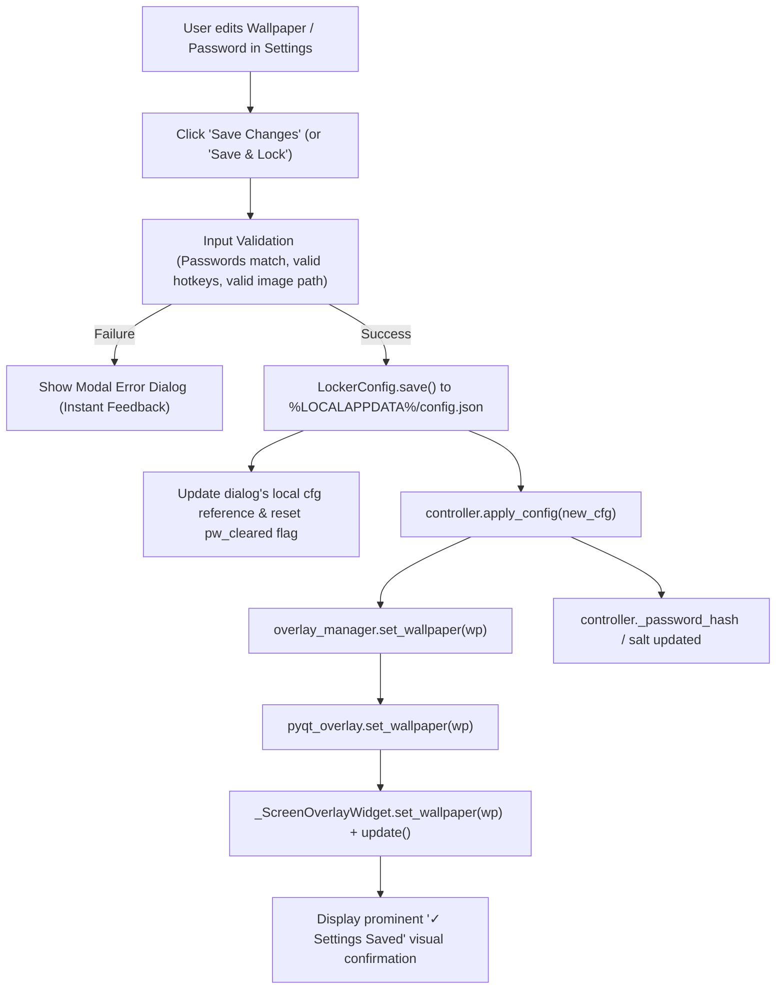

# Settings Persistence & Dynamic State Synchronization: Evaluation & Action Plan

**Product:** Input Locker (Microsoft Store Edition)  
**Issue Category:** UI/UX & Live Runtime Configuration State Synchronization  
**Reported Issues:**
1. *Wallpaper persistence / reload*: Selecting a new lock screen wallpaper or clearing an existing one continues to display the old/initial wallpaper on the lock screen overlay.
2. *Password change failure*: Modifying the unlock password in Settings fails to take effect or verify correctly on subsequent unlock attempts.
3. *Missing Save mechanism*: The settings dialog lacks an explicit, unambiguous "Save Changes" / "Apply" action, causing users to close the window or click Cancel (which silently discards pending modifications in companion mode).

---

## 1. Scope & Root Cause Evaluation

### Root Cause A: Missing "Save Changes" Button & Confusing Action Bar
* **Current UI Layout:**
  The docked action bar at the bottom of `src/input_locker/ui/config_gui.py` currently contains:
  * `cancel_btn` ("Cancel") & Window Close (`[X]`): In companion mode (`standalone=False`), this only calls `hide_window()`. It does **not** persist changes to `config.json` and does **not** notify the running `controller`.
  * `run_bg_btn` ("Run in Background (F11)"): This is misleadingly named for an app that is *already* running in the background when Settings is opened from the system tray or secondary shortcut.
  * `bottom_lock_btn` ("Lock Now"): Users who merely wish to configure settings do not want to immediately lock their screens.
* **Result:** Users configure their wallpaper or password, look for a "Save" button, find none, and click `[X]` or "Cancel", which throws away all unapplied modifications.

### Root Cause B: Overlay Subsystem Lacks Dynamic Wallpaper Refreshing
* **Current Execution Flow:**
  1. `LockerController.apply_config(cfg)` checks:
     ```python
     wp = getattr(cfg, "wallpaper", "")
     if wp and hasattr(self.overlay_manager, "set_wallpaper"):
         self.overlay_manager.set_wallpaper(wp)
     elif hasattr(self.overlay_manager, "wallpaper"):
         self.overlay_manager.wallpaper = wp
     ```
  2. `OverlayManager` has **no** `set_wallpaper()` method!
  3. `PyQtOverlay` has **no** `set_wallpaper()` method!
  4. `_ScreenOverlayWidget` only loaded `QPixmap(wallpaper_path)` once inside `__init__` at initial app boot (`auto_prewarm=True`).
  5. If the user cleared the wallpaper (`wp == ""`), `if wp:` evaluated to `False`, never clearing the background.
* **Result:** Even when `cfg.save()` succeeded, the running overlay widgets retained the initial wallpaper loaded in memory.

### Root Cause C: Stale Dialog Configuration & Password Validation UX
* **Current State Tracking:**
  1. When `show_config_dialog` is called at boot, it captures `cfg`.
  2. In `build_config()`, if no new password is typed in the entry fields, it falls back to:
     ```python
     new_cfg.password = cfg.password
     new_cfg.password_hash = cfg.password_hash
     new_cfg.password_salt = cfg.password_salt
     ```
  3. Because `cfg` inside `show_config_dialog` was never updated to the newly saved config upon subsequent edits, subsequent saves could overwrite newer hashes with the original startup hash.
  4. In `validate()`, if a user typed a new password into the primary field but omitted the confirmation field, `validate()` failed with an inline label (`err_lbl`) that is frequently scrolled out of view, without an explicit user dialog warning.
  5. `pw_cleared[0]` was not reset to `False` if the user clicked "Remove Password" and then subsequently typed a new password.

---

## 2. Architectural Action Plan



### Planned Code Changes:

### Phase 1: Dynamic Wallpaper Updates in Overlay Subsystem
1. **`src/input_locker/overlay/pyqt_overlay.py`**:
   * Add `set_wallpaper(wallpaper_path: str)` to `_ScreenOverlayWidget`:
     - Load `QPixmap(wallpaper_path)` if file exists, or set `None` if empty/invalid.
     - Dynamically toggle stylesheet between transparent and dark glass tint.
     - Call `self.update()` on the Qt UI thread.
   * Add `set_wallpaper(wallpaper_path: str)` to `PyQtOverlay`:
     - Update `self.wallpaper_path`.
     - Propagate `set_wallpaper` to all active screen overlay widgets via thread-safe bridge/signal or direct dispatch.
2. **`src/input_locker/overlay/overlay_manager.py`**:
   * Add `set_wallpaper(wallpaper: str) -> None`:
     - Forward call to `self.overlay.set_wallpaper(wallpaper)`.
     - Update `self.wallpaper = wallpaper`.
3. **`src/input_locker/core/controller.py`**:
   * In `apply_config(cfg)`:
     - Always call `self.overlay_manager.set_wallpaper(wp)` (even when `wp == ""` so clearing wallpaper immediately takes effect).

### Phase 2: Dedicated "Save Changes" Button & Clear UX in Settings GUI
1. **`src/input_locker/ui/config_gui.py`**:
   * Add a prominent primary/accent **"Save Changes"** (or **"Apply Changes"**) button to the docked bottom bar:
     - Clearly labeled: `t("btn_save_changes")` (e.g. `"Save Changes"`).
     - Beside it, keep `t("btn_save_and_lock")` / `"Lock Now"` for instant lock.
     - Keep `cancel_btn` for closing.
   * When saving:
     - If password confirmation fails: Show a clear modal warning messagebox so the user immediately knows why it didn't save.
     - Save to disk via `new_cfg.save()`.
     - Update local dialog `cfg = new_cfg`.
     - Reset `pw_cleared[0] = False`.
     - Update `status_pill` badge to reflect "Password Protected" or "No Password".
     - Clear the password entry boxes so the user sees the saved state.
     - Provide a smooth visual toast / feedback indicator: `"✓ Settings saved successfully!"`
     - Call `on_save(new_cfg)` so the running controller immediately reloads wallpaper and credentials.
   * In `cancel()` / Window Close:
     - If changes are detected, either auto-save or prompt gracefully.

### Phase 3: Verification & Regression Testing
1. Execute unit test suite (`pytest tests/unit/`) to ensure all existing tests pass.
2. Add comprehensive unit tests in `tests/unit/test_config_sync.py`:
   - Test `overlay_manager.set_wallpaper()` with valid image and empty string.
   - Test `controller.apply_config()` dynamic credential updates.
   - Test `build_config()` with password clearing, updating, and persistence.
